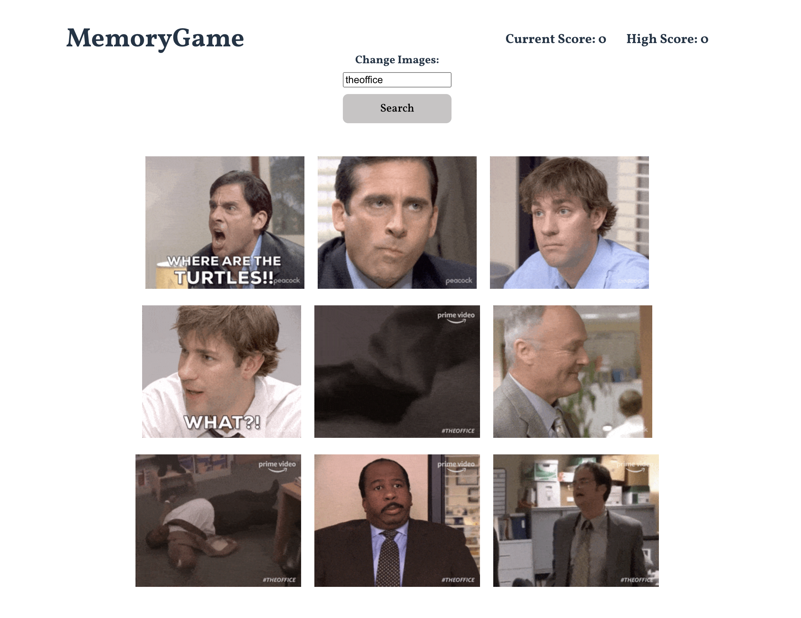

# Project Memory Game

The Memory Game project was created according to the assignment from The Odin Project, which can be found [here](https://www.theodinproject.com/lessons/node-path-react-new-memory-card).

A live preview of the project can be found [here](https://stellar-mermaid-62f8fb.netlify.app/).

## Project Overview

The goal of the project was to create a memory game using basic React concepts such as using and creating React `Components` `props`, `state`, and `lifting state up`. This project also focused on using an API and working with the `useEffect` hook. 

## Previews

## Learning Outcomes

The project helped solidify the following:

-   Creating and setting up a React project.
-   Structuring the project logically into different components and implementing reusability.
-   Using buttons to create conditional layouts.
-   Using `state` to store both objects and arrays of objects via user input. Further, using state to provide live output of user input.
-   Using `props` to pass down variables and functions for use in various different areas of the application.
-   Using `useEffect` hook to control rendering and limiting side effects.
-   Create directory structure for organization.

## Technologies Used

- React
- HTML / CSS
- JavaScript
- Git